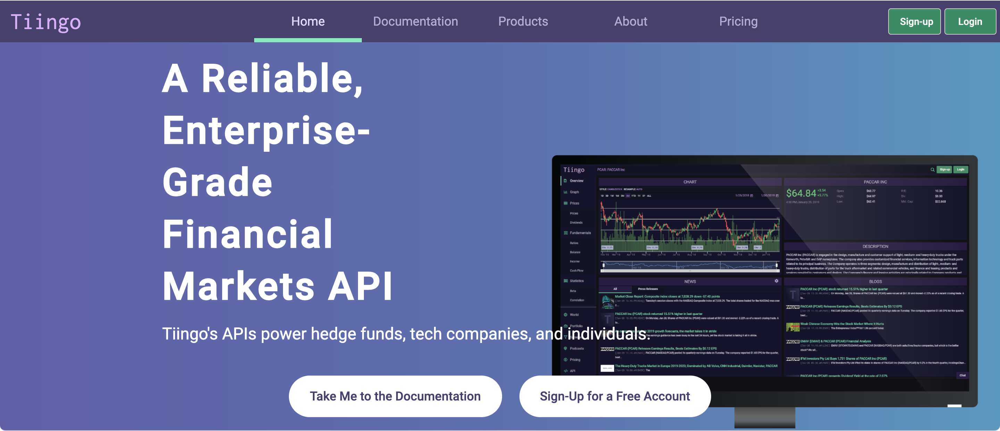

# Python Flask based Stock application Backend

This repository is part of a stock search web application, it only contains the source code for Node javascript backend. The Angular frontend is present here: https://github.com/hyu2950/Angular_Stock_Web_Application

<h2>Consume REST API's</h2>
<a href="https://api.tiingo.com/">Tiingo API</a>  
 
<a href="https://newsapi.org/">News API</a>  
 

<h2>HighCharts Support</h2>
Use <a href="https://www.highcharts.com/">Highcharts</a> for displaying interactive charts regarding historical financial stock performance  
 

<h2>API response</h2>
The Flask backend also exposes data in the form of a REST API, which can be consumed by any other application (not just the above frontend javascript) 

